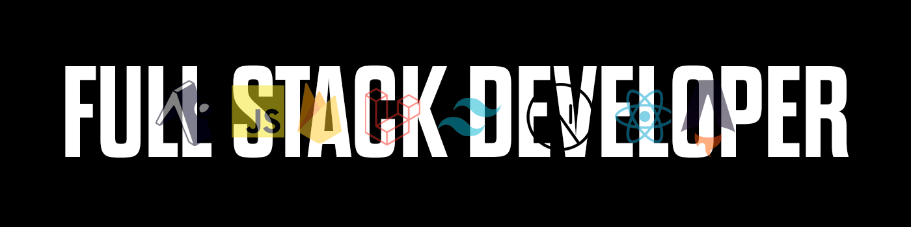

<!-- Header -->

# 🚀 Luciano Balbiano  
**Fullstack Developer | UX/UI Designer**  
Especialista en desarrollo web y móvil con experiencia en **React.js**, **Astro.js** y **React Native**.  
Más de **2 años de experiencia profesional** liderando proyectos completos, optimizando diseños y mejorando la experiencia del usuario.

📧 **Email:** [balbiano06@gmail.com](mailto:balbiano06@gmail.com)  

---

## 📋 **Sobre mí**
- 🎯 **Apasionado por la tecnología** y el diseño UX/UI en Figma.  
- 🚐 **Desarrollé una app que transporta más de 60 mascotas mensuales**.  
- 🛠️ **Tecnologías favoritas:** React.js, Next.js, React Native, Astro.js, GSAP y Firebase.  
- 🔗 [**Portafolio**](https://www.balbianoluciano.com/) | [**LinkedIn**](https://www.linkedin.com/in/luciano-balbiano) | [**GitHub**](https://github.com/BalbianoLuciano)  

---

## 🏆 **Proyectos destacados**

### 🚐 **Pet Bus**  
Desarrollo de una app de transporte de mascotas con reservas de turnos, cálculo de distancias y tarifas utilizando la API de Google Maps.  
📅 **Fecha:** Octubre 2024 - Noviembre 2024  

🛠️ **Tecnologías:**  
  
  
  
  

**Imágenes del proyecto:**  

  
  
  

 

🔗 **Repositorio:** [Ver en GitHub](https://github.com/BalbianoLuciano/pet-bus)

---

### 🌵 **Cactus Media Agency**  
Diseño visualmente atractivo con animaciones GSAP que aumentaron el engagement en un **20%**.  
📅 **Fecha:** Agosto 2024 - Octubre 2024  

🛠️ **Tecnologías:**  
  
  
  
  
  

**Imagen del proyecto:**  
  

🔗 **Repositorio:** [Ver en GitHub](https://github.com/BalbianoLuciano/cactus-agency)  

---

### 📜 **Homenaje a Miguel Montes García**  
Optimización de imágenes y código, mejorando la velocidad del sitio en **30%**.  
📅 **Fecha:** Octubre 2023 - Diciembre 2023  

🛠️ **Tecnologías:**  
  
  
  
  

🔗 **Repositorio:** [Ver en Bitbucket](https://bitbucket.org/mo-studio/website-montes/src/master/)

### 🏗️ **ArchiHub (Proyecto Final)**  
Lideré el desarrollo completo del proyecto final en la academia Henry.  
📅 **Fecha:** Octubre 2022 - Noviembre 2022  

🛠️ **Tecnologías:**  
  
  
  
  

**Imágenes del proyecto:**  
  
  
  

🔗 **Repositorios:**  
- [Frontend](https://github.com/BalbianoLuciano/ArchiHub-Front)  
- [Backend](https://github.com/BalbianoLuciano/backend-arquihub)  

---

## 💻 **Tecnologías y Skills**

### **Desarrollo Web**  
  
  
  
  
  
  
  
  
  
  

### **Desarrollo Móvil**  
  
  

### **Desarrollo de Juegos**  
  
  

### **Bases de Datos**  
  
  
  
  

### **Herramientas y Otros**  
  
  
  
  

---

## 📚 **Educación**
- 🎓 **Academia Henry** - Fullstack Developer *(Julio 2022 - Noviembre 2022)*  
- 🎓 **Informatorio Chaco** - Python/Django *(Mayo 2021 - Agosto 2021)*  
- 🎓 **Udemy** - UX/UI Designer *(Marzo 2024)*  

---
## 🌐 **Idiomas**
- **Español:** Nativo / Bilingüe  
- **Inglés:** B2 Upper Intermediate  
  [Certificado EFSET](https://cert.efset.org/YTogwD)
    
---

## 🔗 **Contacto**
📧 **Email:** [balbiano06@gmail.com](mailto:balbiano06@gmail.com)  
🔗 [**Portafolio**](https://www.balbianoluciano.com/) | [**LinkedIn**](https://www.linkedin.com/in/luciano-balbiano) | [**GitHub**](https://github.com/BalbianoLuciano)  

---

✨ **¡Gracias por visitar mi perfil!** ✨  
