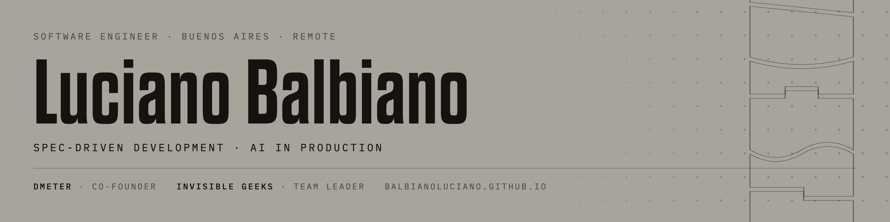
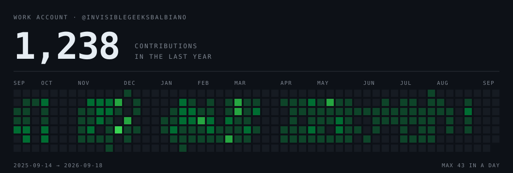

I build AI systems that reach production instead of stopping at a demo: MCP servers, RAG pipelines and agents wired into the systems people already use. I work spec-first — the specification before the code — and keep business rules versioned as data instead of buried in the program.

Six products in production at Dmeter, the studio I co-founded, where I lead the technical decisions and architecture. Before the AI work: five years of Laravel, Vue and TypeScript, large-scale migrations and multi-tenant systems.

Buenos Aires, Argentina. EU citizen (Spain), so no sponsorship for European positions. Remote-first. Portfolio: **[balbianoluciano.github.io](https://balbianoluciano.github.io)**

---

## Where my commits live

Most of my daily code goes to my work account. This one holds the open projects and the side work.

The chart is drawn here, from the public contribution data, and redrawn once a day by a workflow in this repo. Work account: **[@InvisibleGeeksBalbiano](https://github.com/InvisibleGeeksBalbiano)**

---

## Built with AI

**[Gridwright](https://github.com/BalbianoLuciano/gridwright)** — End-to-end layout pipeline driven from Claude Code: a Figma node goes in, and a built, visually verified component registered in the project's design system comes out. A long prompt telling an agent how to build a layout doesn't work — the agent skips the analysis whenever the request looks simple. So the state machine lives on disk and a CLI enforces it: Claude doesn't decide which stage comes next, it asks. Anything that can be checked with an assert is code — pulling assets, distilling the tree, matching tokens, rendering and diffing; naming, the prop API and what to reuse are left to the model. The ruler was built before the factory: every component is rendered with Playwright and compared against the design with a perceptual diff. 250 tests.
*TypeScript · Node · Vite · Tailwind 4 · Playwright · sharp · ts-morph · Claude Code plugin*

**RAG over the studio's knowledge** — Retrieval over our projects and internal documentation with local embeddings and SQLite, no external vector service. Chunking, indexing and retrieval written directly rather than delegated to a framework, so retrieval quality is something I can measure and tune.

**Proposal generation** — RAG over ChromaDB with Llama 3.3 70B through Groq and OpenRouter, including job posting scraping and application tracking. Agentic workflows with state carried between steps, retries and validation.

One design rule runs through all of it: **the system generates, the person decides.** Nothing is sent or published automatically.

---

## In production

**[Hornero](https://hornero.dmeter.com.ar)** — Catalogue and stock engine that runs the same for a clothing shop, a hardware store or a gym: what changes between trades is data, not code. Each business declares its own schema and the dimensions generate the variant matrix. Isolation between businesses is guaranteed by Postgres row-level security rather than the ORM, with **248 tests against a real Postgres**.
*Hono · Drizzle · Cloudflare Workers · Postgres 16 · Next · React 19 · PWA*

**[Prolicht](https://www.prolicht.at)** — Site and catalogue for an Austrian architectural LED manufacturer with two decades of content trapped in a legacy CMS. I migrated **257 projects** with reproducible commands and a dry-run mode to review the diff before applying it, plus a room configurator and a presentation editor with a shareable client link.
*Laravel 12 · Vue 3 · Inertia 2 · Tailwind 4 · MySQL 8 · Docker*

**Portal de Pericias** — Multi-tenant SaaS where a court-appointed expert runs their whole practice: cases, expert reports, fees and deadlines. Eight entities on a layered architecture, digital evidence fingerprinted with MD5/SHA1/SHA256 on upload, documents in private storage, permissions guaranteed at the database level.
*Laravel 13 · PHP 8.5 · Vue 3 · Inertia · MySQL 8.4 · Pest 4*

**[El Zorro Gris](https://elzorrogris.es)** — Platform for older adults across five verticals, with an engine that builds itineraries around how much the traveller can actually take: every activity carries physical effort and mental fatigue on a 1–5 scale, with caps per age segment and adjustments for weather and season. Custom chatbot with streaming, plus a custom EPUB reader with native Epub.js modifications.
*Laravel · Vue 3 · Inertia · Stripe · OpenAI · Claude · Pest · Playwright*

**[Malmberg.nl](https://malmberg.nl)** — Migration of **800+ pages** to HubSpot CMS on a custom React Islands boilerplate with selective hydration: only genuinely interactive components ship JavaScript.
*React 18 · TypeScript · Tailwind · HubSpot CMS · Serverless Functions*

**Relay** — In-house operations workspace: chats, email, files, payments and numbers on a single screen. One inbox where context travels with the thread instead of living in someone's head. It plugs into what a company already uses rather than asking them to migrate all at once.

---

## Open source

**[autofill](https://github.com/BalbianoLuciano/autofill)** — Chrome extension that fills job application forms. The hard part isn't writing into an input: it's recognising which field is which when the HTML doesn't help, and getting the value to actually register. Greenhouse, Lever and Ashby are React, and React discards `element.value = x` — the fix is to invoke the native prototype setter, which bypasses the descriptor React installed on the instance. A dictionary of 38 fields and 385 ways of asking for them across five languages, with a five-step cascade that compares by tokens rather than substrings. 127 tests, several traced from real forms. No LLM: the heuristics cover the case, and the model is documented as the last resort.
*TypeScript · WXT · Manifest V3 · Vitest · happy-dom*

**[Portfolio](https://github.com/BalbianoLuciano/BalbianoLuciano.github.io)** — One screen, no scrolling anywhere, where every deeper level opens as a radial mask from the exact point you clicked. Behind the gates, the projects are pieces of a single column that fit into each other: hovering names one, clicking assembles them and carries the whole set to a different place on screen for each project. Built on a single governing specification written before any code, and every interaction obeys it.
*Astro · React islands · GSAP · Lenis · Tailwind*

---

## Stack

**AI and agents** · Model Context Protocol · Claude Code · OpenAI API · Claude API · Groq · OpenRouter · Llama 3.3
**RAG and data** · ChromaDB · Hugging Face Transformers · local embeddings · SQLite · PostgreSQL · MySQL · Prisma · Drizzle
**Languages** · TypeScript · JavaScript · Python · PHP
**Web** · Laravel · Vue · React · Next.js · Astro · Inertia.js · Tailwind · Hono · Filament
**Infrastructure** · Cloudflare Workers · Docker · GitHub Actions · Vite
**Testing** · Pest · Playwright · Vitest · golden tests
**Method** · Spec-driven development · versioned business rules

---

## Education

**Universidad Tecnológica Nacional** — Tecnicatura Universitaria en Programación *(in progress, Mar 2026 — Dec 2027)*
**Informatorio Chaco** — Python/Django Web Developer *(2021)*
**U.N.N.E.** — Architecture and Urbanism *(2017–2020, incomplete)* — where the interface work comes from
**English** — B2 upper intermediate, [EF SET certified](https://cert.efset.org/YTogwD)

---

## Open to

AI Engineer · Senior Full Stack · Tech Lead · Team Leader. Remote worldwide; EU citizen, so no sponsorship is needed for European positions. Spanish native, English B2.

[Portfolio](https://balbianoluciano.github.io) · [LinkedIn](https://www.linkedin.com/in/luciano-balbiano/) · [balbiano06@gmail.com](mailto:balbiano06@gmail.com)
